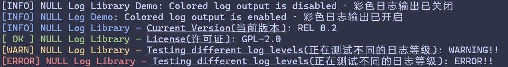

# Null's Log Library
A simple (colored) log library for Qt


<br/><br/>
<a id="readme-top"></a>

## 关于项目 · About The Project

**Nu**ll **L**og **L**ibrary是一个为Qt制作的简易日志工具，它可以帮助您输出美观的彩色日志。<br/>
**Nu**ll **L**og **L**ibrary is a simple library made for Qt, it can help you out beautiful (colored) log for you.
<br/>
<div style="color: orange; background: lightyellow; border-left: 5px solid orange; padding: 7px">
<b>兼容性问题（非常重要） · Compatibility Issue (Very Important)</b><br/>
该库仅在能支持ANSI escape code的终端上能输出彩色文本，部分终端以及IDE（比如CLion）的终端需要进行配置才可以正确输出彩色文本<br/>
This library can only output colored log properly on terminal (emulators) that supports ANSI escape code, and some terminals and IDEs (like CLion) need you to configure them in order to output colored logs properly.
</div>
<p align="right">(<a href="#readme-top">back to top</a>)</p>

### 技术栈 · Built With
* [](qt.io)
* [](https://cmake.org/)

<p align="right">(<a href="#readme-top">back to top</a>)</p>


<!-- GETTING STARTED -->
## 开始使用 · Getting Started
### 前置条件 · Prerequisites
我们假设您使用Qt5或者Qt6以及CMake。<br/>
We assume that you are using either Qt 5 or Qt 6 together with CMake.

### 编译 · Compile
1. 克隆这个仓库到本地。<br/>Clone this repository to your machine.
2. 打开项目的CMake工程（与本README同级，不在`src`或者`demo_src`里），设置如下CMake前缀：<br/>Open the CMake project (which is at the same level with this README, it is not that ope in `src` nor `src_demo`) and set the following Cmake Prefix:
    ``` Shell
   -DCMAKE_PREFIX_PATH:PATH="<Qt安装路径 · Qt Installation path>"
    ```
   比如：<br/>For example: 
    ``` Shell
   -DCMAKE_PREFIX_PATH:PATH="D:/SDK/Qt/6.8.0/msvc2022_64"
    ```
3. 编译这个库，请注意**库不会自动安装到系统**。<br/>Start compiling, please note that **THE LIBRARY WILL NOT BE INSTALLED TO YOUR SYSTEM**.

### 导入库 · Importing
1. 对于导入库，可以参考[`./demo_src/CMakeLists.txt`](./demo_src/CMakeLists.txt)。<br/>For importing, you may refer to the demo example at [`./demo_src/CMakeLists.txt`](./demo_src/CMakeLists.txt).
2. 您应该需要修改一下其中路径到自己的导入位置，如果您不作为子项目引入的话，请尤其注意`target_include_directories`，该值决定了库中的头文件是否能被找到，本项目的`/includes`文件夹里面有所需的所有头文件，需要的话可以复制一份。<br/>You might want to adjust the import path in that `CMakeList` to fit your project, please **ESPECIALLY NOTE THE VARIABLE** `target_include_directories`, which decided whether IDE would tell you that you got missing header(s) (from this library). The `/includes` folder of this project contains all the headers you will need, and you can copy that if needed.

### 拷贝库文件（非常重要） · Copy the Library File (Very Important)
* 如果您的程序闪退，并且是由于缺少库文件引起，请注意我们的例子没有自动拷贝库到二进制文件路径的功能，如果您是完全参考它写的引入，您应该考虑自己实现一个或者手动拷贝。<br/>If your program crashed due to missing library file, please note that our demo does not automatically copy the library to the binary location, so you may want to implement that or copy the library file manually.

<p align="right">(<a href="#readme-top">back to top</a>)</p>


<!-- USAGE EXAMPLES -->
## 使用 · Usage
以下是本库目前支持的函数的签名：<br/>
Here are the function signatures that you can use: 
``` c++
    static void setIsColorEnabled(bool result);
    static bool getIsColorEnabled(void);

    static QString info(const QString& tag, const QString& content);
    static QString info(const QString& tag, const QString& title, const QString& content);
    static QString ok(const QString& tag, const QString& content);
    static QString ok(const QString& tag, const QString& title, const QString& content);
    static QString warn(const QString& tag, const QString& content);
    static QString warn(const QString& tag, const QString& title, const QString& content);
    static QString error(const QString& tag, const QString& content);
    static QString error(const QString& tag, const QString& title, const QString& content);
```

* **`setIsColorEnabled`**: 设置彩色日志输出是否开启，`true`为开启，`false`为关闭；彩色日志输出默认开启。这是全局设置，并且设置后会产生一条日志。
* **`setIsColorEnabled`**: Set if colored log output should be enabled, `true` for enabling and `false` for disabling; Colored log output is enabled by default. This is global config, and a log will be generated after you toggle the setting.
* **`getIsColorEnabled`**: 获取彩色日志输出状态，返回`true`为开启，`false`为关闭。
* **`getIsColorEnabled`**: Get if colored log output is enabled, returning `true` for enabling and `false` for disabling.
* 剩下这些函数都是负责输出日志的，函数名即为日志等级，参数介绍请参考下方的表格：
* And all other functions are responsible for generating logs, see table below for explanation of these parameters: 

| 名称 · Parameter Name | 解释 · Explaination                                                                | 是否必须 · Is that Required |
|---------------------|----------------------------------------------------------------------------------|-------------------------|
| tag                 | 您定义的标签名，用于告诉其他开发者这是哪个模块正在输出日志                                                    | 是                       |
| tag                 | Tag name that is defined by you that tells others which module is generating log | Yes                     |
| title               | 可选的标题名，用于进一步定位产生日志的代码                                                            | 否                       |
| title               | Optional title that helps locating the code that throws the log                  | No                      |
| content             | 日志的具体内容                                                                          | 是                       |
| content             | Content of your log                                                              | Yes                     |

<div style="color: orange; background: lightyellow; border-left: 5px solid orange; padding: 7px">
<b>注意 · Notice</b><br/>
1. <code>OK</code>使用的是<code>qInfo</code>。<br/>
2. 本库目前不会储存任何产生的日志，但是这些日志生成函数的返回类型都是<code>QString</code>，内容是（没有颜色的）您的日志内容，您可以利用这个自己实现日志储存。<br/><br/>
1. Log level <code>OK</code> uses <code>qInfo</code>.<br/>
2. Currently this library will not store any log generated so you may need to implement your own way. You may notice that the return type of each log generating function is <code>QString</code> and they are actually returning the log generated (without color) so you may use them.
</div>

<p align="right">(<a href="#readme-top">back to top</a>)</p>

<!-- ROADMAP -->
## 正在开发的功能 · Roadmap

- [✔ 已完成 · Completed] Log generating · 基础日志生成
- [🔧 正在开发 · Developing] Log storing · 日志储存
- [🔧 正在开发 · Developing] Log displaying widget · 日志显示微件

<p align="right">(<a href="#readme-top">back to top</a>)</p>

<!-- LICENSE -->
## 许可证 · License
本项目以GPL-2.0许可分发，请参阅[LICENSE](./LICENSE)文件以获取更多信息。<br/>
This project is distributed under GPL-2.0. See [LICENSE](./LICENSE) for more information.

<p align="right">(<a href="#readme-top">back to top</a>)</p>

<!-- ACKNOWLEDGMENTS -->
## 感谢 · Acknowledgments
* [Best-README-Template](https://github.com/othneildrew/Best-README-Template/tree/main)